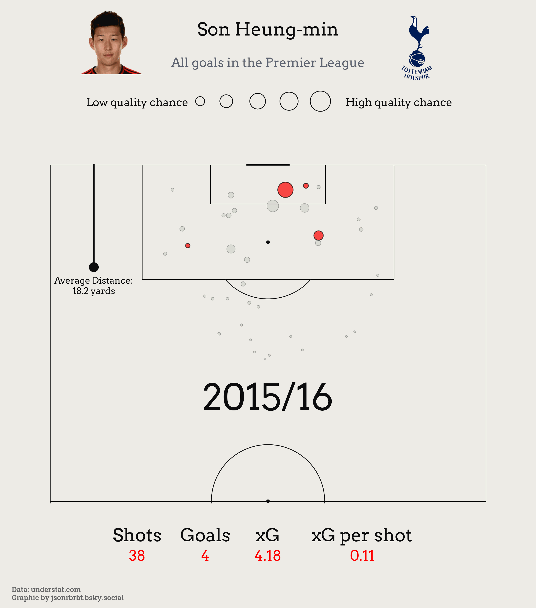

# Son Heung-min Shot Map (Premier League, 2015-2025)

An animated shot map visualizing Son Heung-min’s **non-penalty shots and goals** across **10 Premier League seasons (2015–2025)**.  
This project highlights **how his shot volume, locations, and finishing have evolved over time**.

## Tools Used
- Python (pandas, matplotlib, mplsoccer)
- Public match event data: understat.com
- Player portrait: sofifa.com

## Animated Season-by-Season Shot Map 🎥

This animation shows Son Heung-min's non-penalty shots and goals across 10 Premier League seasons (2015–2025).

## Key Takeaways
- **Consistent Scorer:** Son reached double-digit league goals in 8 of his 10 Premier League seasons. The only exceptions? His debut year and his most recent campaign.
- **Open Play Threat:** Despite not taking penalties (with Harry Kane being the primary taker for most of his Spurs career), Son maintained an impressive scoring output—averaging 78 shots per season, showing his potency in open play.
- **Tactical Fit:** At his best, Son scored many of his goals from central areas inside the box—perfectly complementing Kane, who often dropped deeper during build-up phases.
- **2024/25 Dip in Form:** This past season raised questions. Son posted career lows in npxG/90, shots/90, and shots on target/90, playing just 2,110 minutes—his lowest league total since 2018/19.
- **Context Matters:** Spurs struggled as a team, and Son was frequently benched post-February to stay fresh for their Europa League run.
- **A New Chapter with Thomas Frank:** The arrival of a coach known for maximizing unconventional forwards (see Bryan Mbeumo and Yoane Wissa at Brentford) offers hope for a Son resurgence.
- **The Harsh Reality:** Given Spurs' ruthlessness—sacking Postecoglou despite a historic European trophy—Son's future at the club is far from guaranteed. If this was his last season, fans can reflect on a decade of iconic moments, ending with a trophy lift in Bilbao. Not every football story ends with a fairytale, but fittingly for Son, this one just might.

## File Overview
- 'son_shotmap.ipynb': Python notebook with code and visuals
- 'son_shotmap.gif': Animated visualization by season

## Data Source
- Public match event data from [Understat](https://understat.com/).  
- **For educational and non-commercial use only.**

## Author
[@jsonrbrt.bsky.social](https://bsky.app/profile/jsonrbrt.bsky.social)